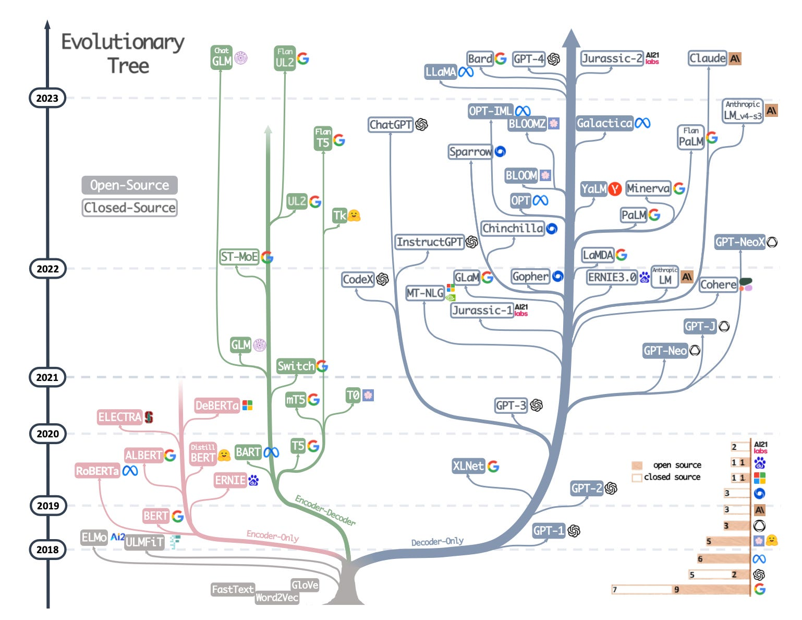
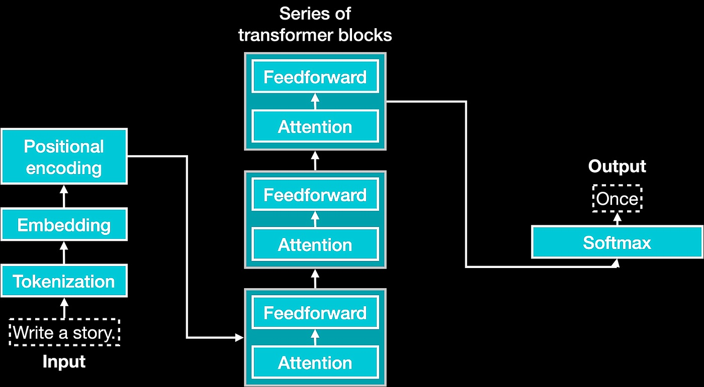

# Lecture 5 - Feb. 28, 2024

## Housekeeping
- You will receive a DM if you have not taken quiz, completed assignments, or setup CI channel notifications...
- * [How to hook in Discord](https://gist.github.com/SGTGunner/50d6a3cc0d489cf779f77695ba3e22ea)
- Abandoning use of Azure AI for now; have not found commercial sponsore (yet)
- Plan on setting up local LLMs w/Aider week after next 
- Class lecture videos now avaialable on permalink (see Canvas)
- Should be able to install [Warp under WSL](https://github.com/warpdotdev/Warp/issues/4240#issuecomment-1960429829)
- New quiz out tomorrow; Due Monday at midnight
- Where everyone should be:
- * Core repo cloned and forked; ssh keys setup
- * Added GitHub user jeffrey-l-turner as a collaborator to your forked repo
- * Discord CI channel notifications for push pull
- * Pull Request for homework submitted to YOUR fork, not mine...
- * If on Windows, WSL installed and used
- * Should be able to:
```
git pull upstream
git push origin # on your cloned repo to your fork
# see push and PR notifications in Discord
# Able to add me as reviewer for PRs on GitHub
```

## Class Notes - Transfomers in Depth
- Expertise (including Language) 
- Tokenization (last week)
- Embedding
- Positional Encoding
- Feedfoward Networks
- Attention
- Context Window

### Evolution
<div align="center">
  
</div>

### Building Blocks
<div align="center">
  
</div>

## From previous class
Note Diagram. From [Andrej Karpathy](https://karpathy.ai/) [see](https://www.youtube.com/watch?v=zduSFxRajkE):
```
• Mhy cant LUM spell well? 
• Why cant LLM do super string processing like inverting a string?
• Why are LLMs bad at simple arithmetic? 
• Why dd GPT-2 have more trouble with coding in Python 2? 
• Why did my LLM abruptly halt when it sees "<endoftext>"? 
• What is this weird warnirg about "trailing whitespace"? 
• Why woul I prefer to use YAML over JSON win LLMs? T
• What is the root of my LLM suffering? 
```

- [Dr. Vivek Haldar's Presentation](https://docs.google.com/presentation/d/1MJDj0ClOdkJ82_uIqpciVHd_aTz8uPA_9HvAAm3bYqs/edit#slide=id.g251cd9882c6_0_42)

## References:
- [Andrej Karpathy part II](https://youtu.be/zduSFxRajkE?si=2lUFNJM1ke96fTQd)
- [Transformers, Tokenization, and Embedding](https://vaclavkosar.com/ml/transformer-embeddings-and-tokenization)
- [Type Theory and LLM](https://medium.com/@andrew_johnson_4/harnessing-the-power-of-type-theory-in-large-language-models-351691ca2644) {behind pay wall}
- [Embeddings and LLMs](https://datasciencedojo.com/blog/embeddings-and-llm/)
- [Transformers to Prompts](https://www.holisticai.com/blog/from-transformer-architecture-to-prompt-engineering)
- [Transfomers Visually Part I](https://towardsdatascience.com/transformers-explained-visually-part-1-overview-of-functionality-95a6dd460452)
- [Transfomers Visually Part II](https://towardsdatascience.com/transformers-explained-visually-part-2-how-it-works-step-by-step-b49fa4a64f34)
- [Transformers Visually Part III](https://towardsdatascience.com/transformers-explained-visually-part-3-multi-head-attention-deep-dive-1c1ff1024853)
