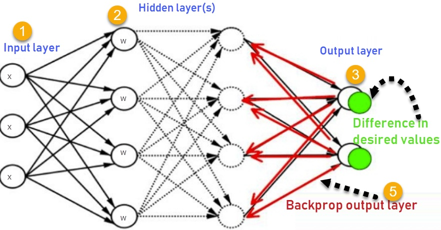
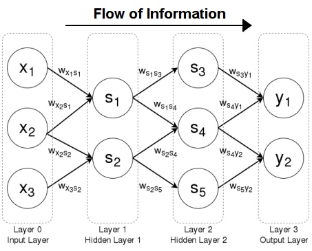
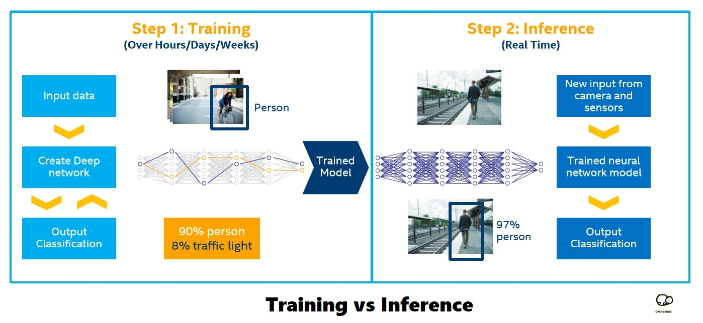

# Lecture 5 - March 6, 2024

## Housekeeping
- Reminder: You will receive a DM if you have not taken quiz, completed assignments, or setup CI channel notifications...
- * [How to hook in Discord](https://gist.github.com/SGTGunner/50d6a3cc0d489cf779f77695ba3e22ea)
- Will be using Azure infrastructure. Setting up local LLM with custom Aider API
- Class lecture videos now avaialable on permalink (see Canvas)
- Reminder Should be able to install [Warp under WSL](https://github.com/warpdotdev/Warp/issues/4240#issuecomment-1960429829)
- New quiz out; Recommend waiting until after class to take.
- Where everyone should be:
- * Core repo cloned and forked; ssh keys setup
- * Added GitHub user jeffrey-l-turner as a collaborator to your forked repo
- * Discord CI channel notifications for push pull
- * Pull Request for homework submitted to YOUR fork, not mine... Should be up to date with GitHub. If not, please DM.
- * If on Windows, WSL installed and used
- * Should be able to:
```
git pull upstream
git push origin # on your cloned repo to your fork
# see push and PR notifications in Discord
# Able to add me as reviewer for PRs on GitHub
```
- * With class pivot, we'll be putting emphasis on final project. Will use only open source code. Spring break week will have larger homework/task.
- * Elon Musk Open AI/Altman suit deep dive: https://youtu.be/jPuLfomqS1Q?si=v6SAksSYIhmC5G_y

## Local LLM Architectures
- User Interface and eXperience (UI & UX)
- Command Line Reproducibility (comparison to Copilot)
- Training
- * Backpropagation
- * Weights and Biases
- Inference
- Literalization and Tokenization
- Feedfoward Networks
- Context Window

### Backpropagation
<div align="center">
  
</div>

### Feedforward ANNs
<div align="center">
  
</div>

### Inference and Training
<div align="center">
  
</div>

## References:

- [Training vs. Inference](https://community.arm.com/arm-community-blogs/b/ai-and-ml-blog/posts/ai-basics-training-vs-inference-whats-the-difference) 
- [Feedforward ANNs](https://cs.stanford.edu/people/eroberts/courses/soco/projects/neural-networks/Architecture/feedforward.html)
- [Backpropagation, weights, biases](https://towardsdatascience.com/weights-biases-and-backpropagation-bb9dfbb10f62)
